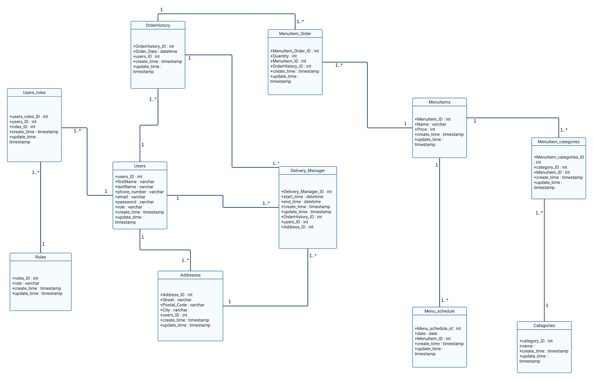

# Express Food – Conception UML et base de données MySQL

Projet réalisé dans le cadre de la formation développeur web Openclassrooms
L’objectif du projet est de concevoir la solution technique d’une application de restauration en ligne appelée **Express Food**.  
Le travail porte principalement sur l’analyse du besoin, la modélisation UML, la conception du modèle de données et la création d’une base de données MySQL.

---

## Présentation du besoin

Express Food est une entreprise de livraison de repas.

Chaque jour, Express Food prépare **2 plats** et **2 desserts** dans son QG avec l’aide de chefs expérimentés. Les plats sont conditionnés à froid puis transmis à des livreurs à domicile. Ces livreurs circulent ensuite en ville en attendant qu’une commande leur soit attribuée.

Lorsqu’un client passe commande depuis l’application, un livreur disponible est missionné pour livrer la commande en moins de **20 minutes**.

L’application doit permettre :

- aux clients de consulter les plats et desserts du jour ;
- aux clients de commander un ou plusieurs plats ou desserts ;
- aux livreurs de prendre en charge une commande ;
- au client de suivre l’état de sa commande ;
- à l’entreprise de gérer les plats du jour, les clients, les livreurs et les commandes passées.

---

## Objectifs du projet

Le projet consiste à concevoir une base de données capable de stocker les informations nécessaires au fonctionnement de l’application Express Food.

La base doit notamment permettre de gérer :

- la liste des clients ;
- la liste des livreurs ;
- les rôles des utilisateurs ;
- les adresses des utilisateurs ;
- les plats et desserts proposés ;
- les plats du jour ;
- les commandes passées ;
- les éléments commandés ;
- l’affectation d’un livreur à une commande ;
- les informations liées à la livraison.

---

## Technologies utilisées

- **UML** : modélisation des besoins et des entités de l’application.
- **MySQL Workbench** : conception du modèle de données et génération du script SQL.
- **MySQL** : création du schéma relationnel.
---

## Diagramme UML



---

## Structure du dépôt

```txt
express_food/
│
├── P4_01_UMLdiagram.png          # Diagramme UML / modèle de données
├── P4_02_MySQLdatabase.sql       # Script SQL de création de la base
├── P4_02_MySQLdatabase.sql.mwb.bak
├── P4_dbl.mwb                    # Fichier MySQL Workbench
└── README.md                     # Présentation du projet
